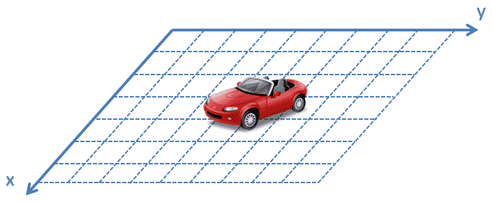
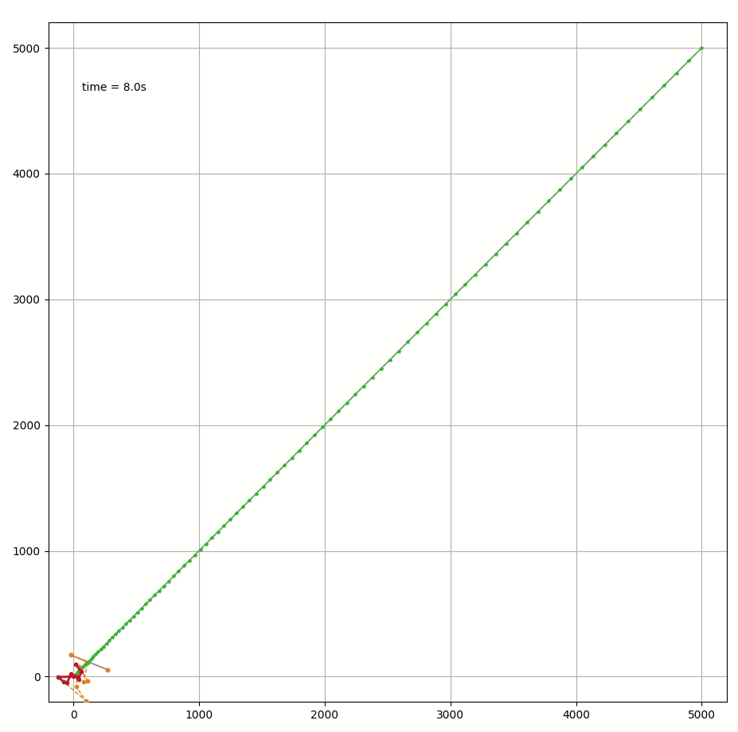

# kalman_filter_example
```markdown
"If you can't code it simply, you don't understand it well enough."
-- kalman filter yyds
```
Some **python** example following this article: https://www.kalmanfilter.net/default.aspx
# Install
```bash
pip install -r requirements.txt
```
## Example 9 : VEHICLE LOCATION ESTIMATION

```bash
python examples/example_9_constant_acceleration.py
```

